# Love Babbar's 450 DSA Problems

This repository contains the solutions to Love Babbar's 450 DSA (Data Structures and Algorithms) problems. The problems
are categorized into various topics and are designed to help you improve your coding skills.

## Topics Covered

- Arrays

  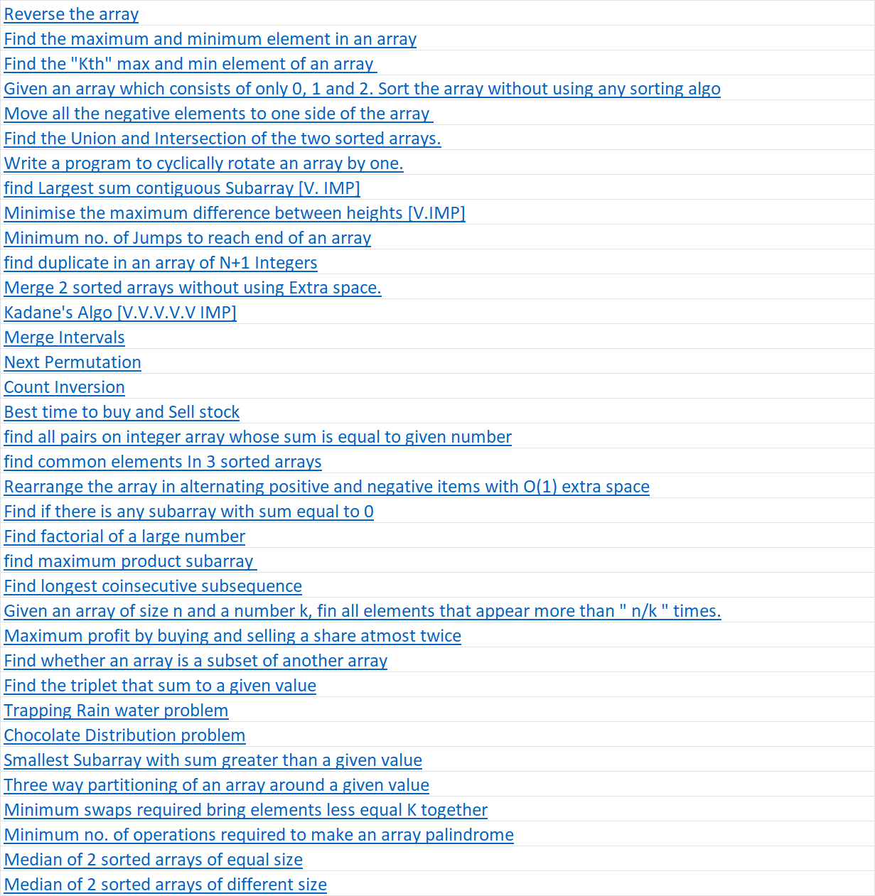
- Strings

  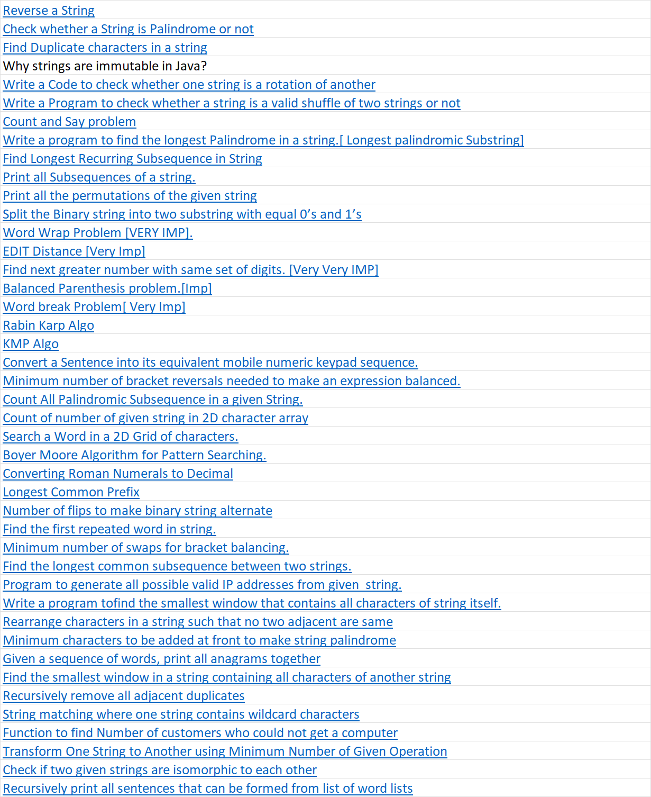
- Searching and Sorting

  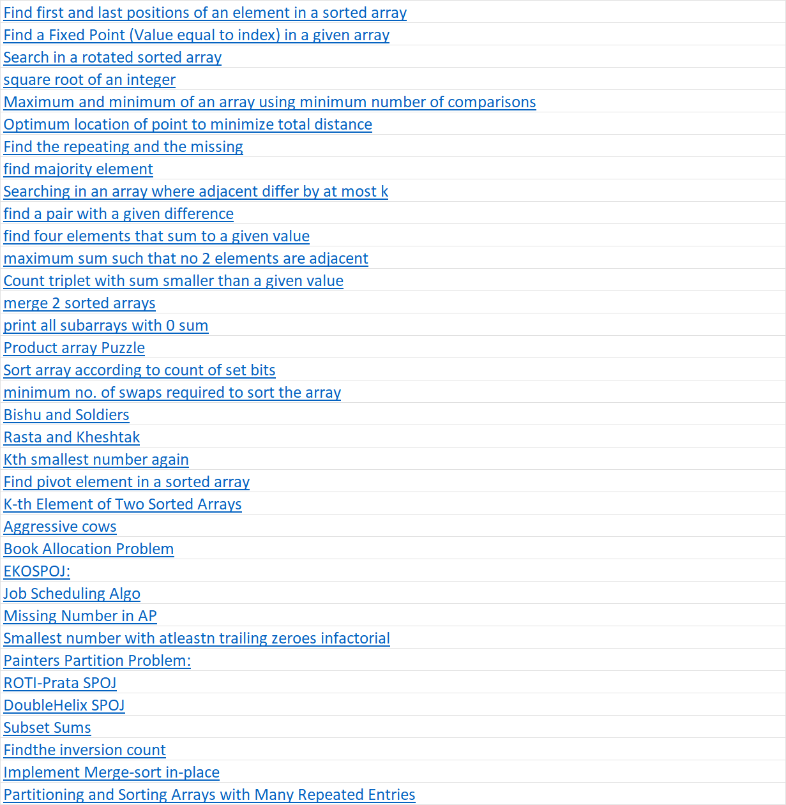
- Linked Lists

  
- Binary Trees

  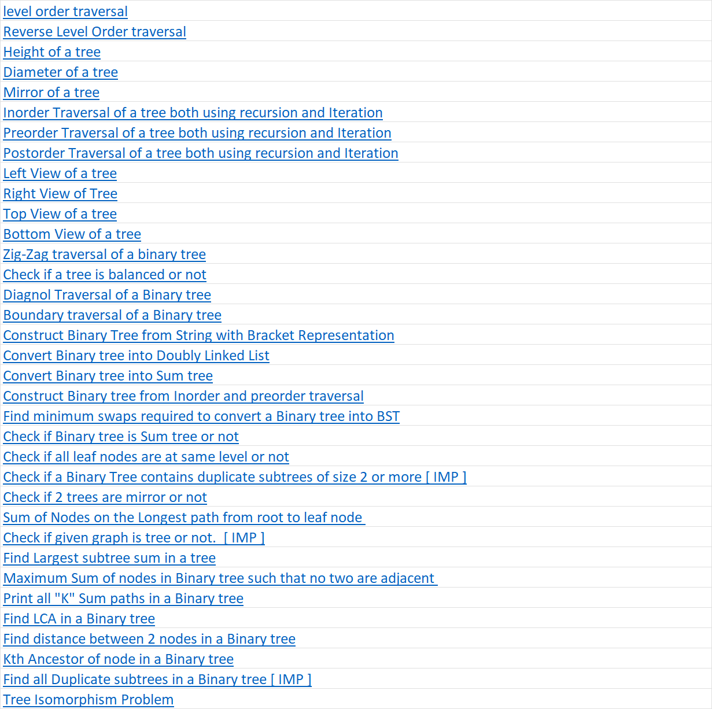
- Binary Search Trees

  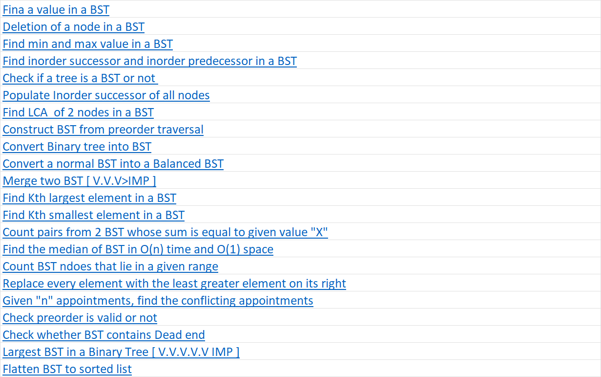
- Greedy

  
- Backtracking

  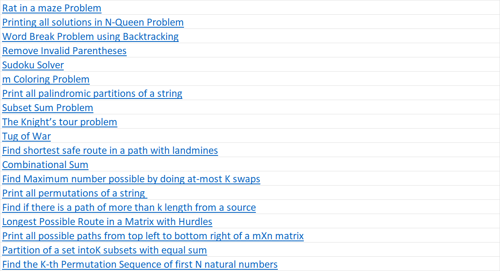
- Dynamic Programming

  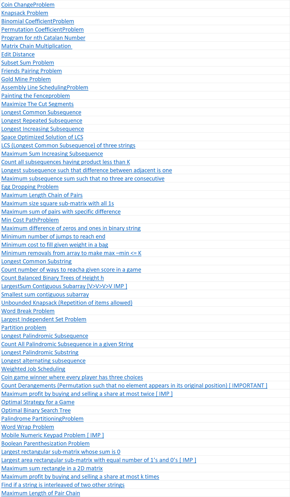
- Bit Manipulation

  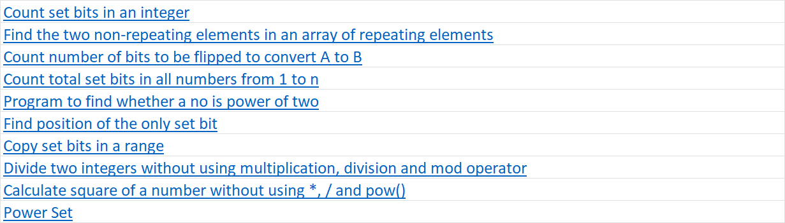
- Graph

  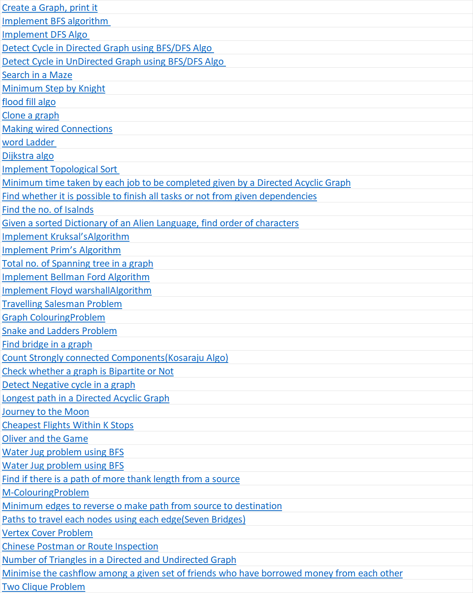
- Trie

  
- Stack and Queue

  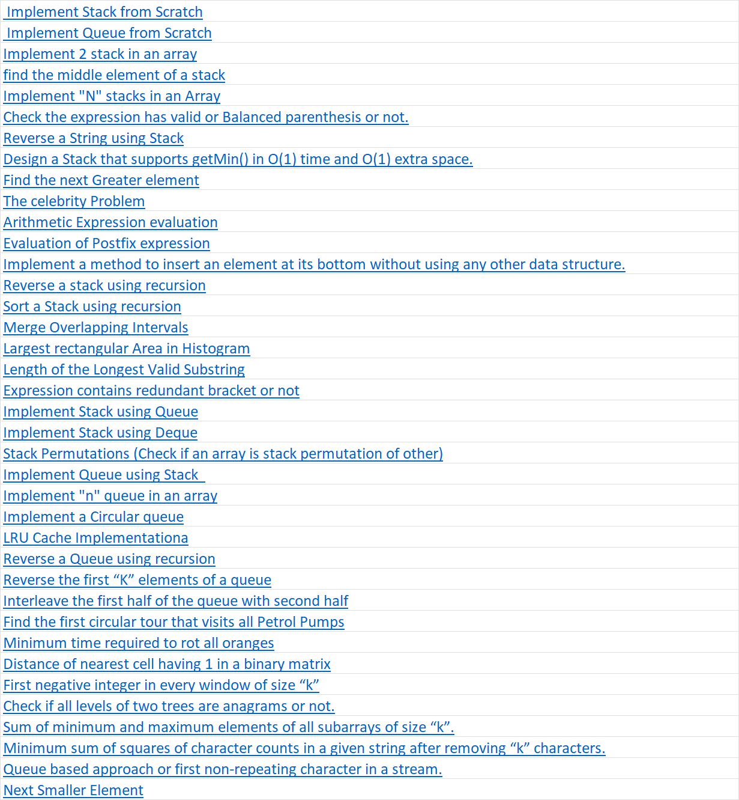
- Heap

  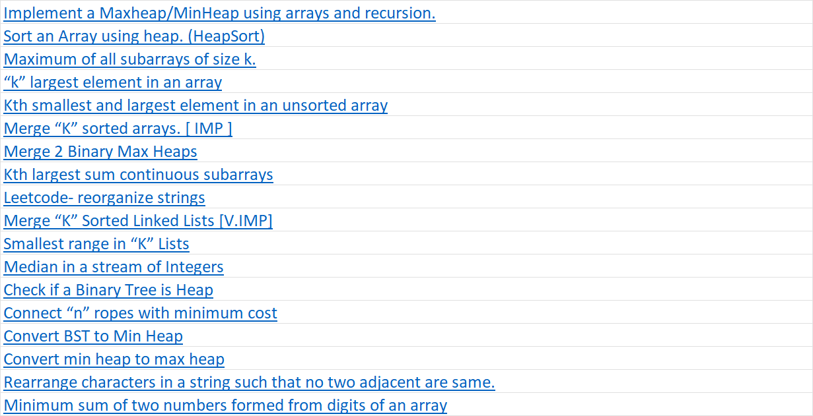

### More notes

The Rabin-Karp algorithm is a string-searching (or substring searching) algorithm that uses hashing to find any one of a set of pattern strings in a text. It is particularly useful when dealing with multiple patterns and when the patterns are expected to be of the same length. The advantage of this algorithm is that its average and best case time complexity is
O(n+m), where n is the length of the text and
m is the length of the pattern. However, its worst-case time complexity is
O(nm), which can occur due to the possibility of hash collisions.

The Knuth-Morris-Pratt (KMP) algorithm is an efficient string searching (or substring searching) algorithm that improves the worst-case time complexity to O(n+m), where n is the length of the text and m is the length of the pattern. This efficiency is achieved by using a preprocessing step to create a partial match table (also known as the "prefix table" or "failure function") that helps to skip unnecessary comparisons in the search process.